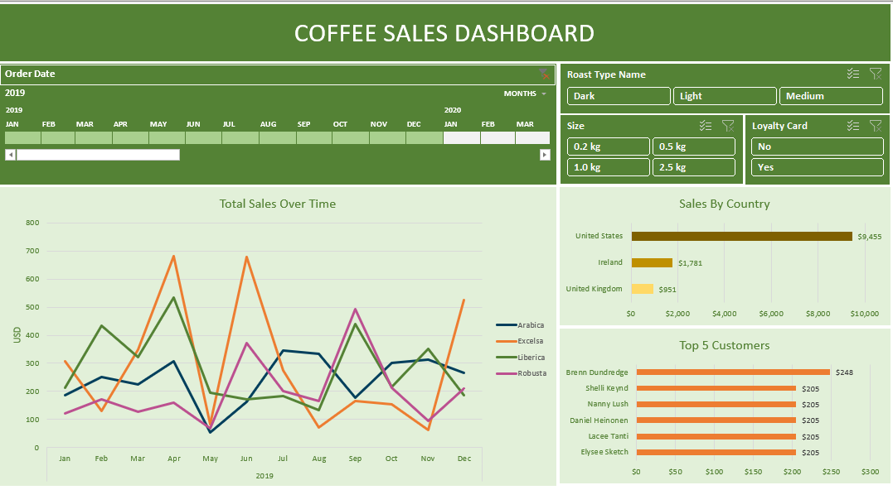

# ☕ Coffee Sales Dashboard – Excel Project

This project explores multi-year sales data for a coffee company and presents a dynamic dashboard built in Microsoft Excel to uncover trends, highlight key performance indicators, and support better business decisions.

## 📸 Dashboard Preview

## 📌 Project Objective

To transform raw sales data into a clean, interactive dashboard that answers business questions such as:

- Which roast type and product size drive the most revenue?
- How do sales vary by time, region, and customer?
- Who are the top-performing customers and countries?
- How can we use filters to segment data by loyalty card usage, date, and more?

## 🛠 Key Excel Skills & Features Used

- `XLOOKUP` and `INDEX MATCH` for dynamic data retrieval
- Multiple `IF` statements and calculated fields for sales logic
- Data cleaning (duplicate checks, date formatting, named ranges)
- Pivot Tables, Pivot Charts, Timelines, and Slicers
- Dashboard design and formatting best practices

## 📊 Outcome

An interactive, visually appealing Excel dashboard that allows users to explore trends in roast types, sales by country, customer performance, and seasonal changes — all filterable by multiple dimensions.

## 🎓 Guided By

[Excel Coffee Sales Dashboard - YouTube Tutorial](https://www.youtube.com/watch?v=m13o5aqeCbM&t=97s)

## 📁 Files

- `coffee_sales_dashboard.xlsx` – Final Excel dashboard
- `raw_data/` – Original data used
- `images/` – Screenshots of the dashboard
- `README.md` – Project overview

---

Feel free to explore, replicate, or modify this dashboard for your own learning or reporting use cases.

